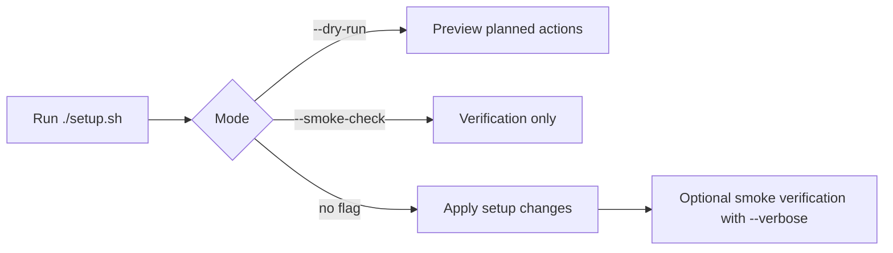

# Dotfiles Bootstrap

Opinionated Linux dotfiles + bootstrap automation for a fast, repeatable developer environment.

<!-- BADGES:START -->
[](#prerequisites)
[](./setup.sh)
[](#idempotency-guarantees)
[](./LICENSE)
[](https://github.com/wyattowalsh/dotfiles/commits)
<!-- BADGES:END -->

> [!NOTE]
> This repo is currently tuned for Debian/Ubuntu-style systems (`apt-get`) and expects network access for package and release downloads.

## At a glance

| Platform | Entrypoint | Re-run safety |
|---|---|---|
| Debian/Ubuntu-style Linux (`apt-get`) | [`setup.sh`](./setup.sh) | Safe to re-run with idempotent guards and convergence checks |

## Table of contents

- [At a glance](#at-a-glance)
- [Overview](#overview)
- [Quick start](#quick-start)
- [Run modes](#run-modes)
- [Prerequisites](#prerequisites)
- [What gets installed/configured](#what-gets-installedconfigured)
- [Reference](#reference)
  - [File map](#file-map)
  - [AI tooling + MCP servers](#ai-tooling--mcp-servers)
  - [Idempotency guarantees](#idempotency-guarantees)
  - [Customization guidance](#customization-guidance)
  - [Troubleshooting](#troubleshooting)
- [Security notes](#security-notes)
- [License](#license)

## Overview

This repository centers on a single entrypoint: [`setup.sh`](./setup.sh). Running it installs core CLI tooling, shell/runtime dependencies, AI CLIs, and then symlinks repo-managed config files into `$HOME` so your environment is reproducible and easy to version.

Key goals:

- ✅ **Repeatable setup** (safe to re-run)
- ✅ **Minimal manual steps**
- ✅ **Clear ownership** of shell/editor/git/AI config

> [!TIP]
> Keep this repo in a stable path on disk; symlinks point to the clone location.

---

## Quick start

```bash
git clone <your-fork-or-this-repo-url> ~/dotfiles
cd ~/dotfiles
./setup.sh
exec zsh -l
```

> [!CAUTION]
> Clone this repo into a permanent path first (for example `~/dotfiles`); moving it later can break symlink targets managed by `setup.sh`.

Checklist:

- [ ] Clone repo to your preferred permanent location
- [ ] Run `./setup.sh`
- [ ] Open a new terminal (or `exec zsh -l`)
- [ ] Confirm links and tools with the verification steps below

<details>
<summary><strong>Post-install verification</strong></summary>

```bash
ls -l ~/.zshrc ~/.p10k.zsh ~/.gitconfig ~/.ripgreprc ~/.editorconfig
command -v zsh eza lazygit zoxide yazi uv go claude gemini copilot codex
gh extension list | rg gh-copilot
```

</details>

---

## Run modes

`setup.sh` supports hardened execution flags:

- `--dry-run`: print planned actions without mutating system state
- `--verbose`: enable debug logging and run post-setup smoke verification
- `--smoke-check`: run verification checks only (no setup mutations)

> [!TIP]
> On a new machine, start with `./setup.sh --dry-run --verbose` to preview changes before mutating state.



---

## Prerequisites

| Requirement | Why it is needed | Quick check |
|---|---|---|
| Linux (`x86_64` or `arm64`) | GitHub-release binaries are architecture-specific | `uname -m` |
| `bash`, `git`, `curl` | Script runtime + cloning + downloads | `command -v bash git curl` |
| `sudo` (or root) | `apt-get`, `/usr/local/bin`, `/usr/local/go`, `chsh` flows | `command -v sudo` |
| `apt-get` | Installs baseline packages and `.deb` release assets[^apt] | `command -v apt-get` |
| Internet access | Fetches installers/assets from GitHub, go.dev, npm, astral, etc. | `curl -I https://api.github.com` |

> [!WARNING]
> On systems without `apt-get`, `setup.sh` skips apt-based installs (including GitHub `.deb` assets like `zoxide` and `yazi`) with warnings.

---

## What gets installed/configured

`setup.sh` performs these high-level phases:

1. Installs missing apt packages (`curl`, `wget`, `unzip`, `zsh`, `fzf`, `bat`, `fd-find`, `ripgrep`, `git-delta`, `direnv`, `jq`)
2. Installs Oh My Zsh + Powerlevel10k + Zsh plugins (autosuggestions/syntax-highlighting)
3. Installs `eza`, `lazygit`, `zoxide`, `yazi` from latest GitHub releases
4. Installs Node via `nvm` (LTS), Python tool runner `uv`, and Go
5. Installs AI CLIs (`claude`, `gemini`, `copilot`, `codex`) plus `gh-copilot` for `gh` (when available)
6. Installs shared skills from `wyattowalsh/agents` (no `gh:` prefix) for supported CLIs
7. Mirrors universal skills from `~/.agents/skills` into `~/.copilot/skills`, `~/.codex/skills`, and `~/.gemini/skills` (when those CLIs are installed) for skill detection
8. Clones `~/dev/tools/agents` and installs `wagents` via `uv` (if missing)
9. Symlinks managed config files into `$HOME`
10. Attempts to set default shell to `zsh`

<details>
<summary><strong>Detailed install matrix</strong></summary>

| Area | Installed/configured by `setup.sh` | Idempotent behavior |
|---|---|---|
| Base packages | apt install of missing tools only | Skips commands already present |
| Zsh framework | Oh My Zsh + plugin/theme clones | Clones only when missing |
| Node runtime | `nvm install --lts` + default alias | Reuses installed `nvm`; tracks current LTS[^lts] |
| Python tooling | `uv` installer | Skips if `uv` already exists |
| Go runtime | Latest Go tarball into `/usr/local/go` | Skips if `go` already exists |
| AI CLIs | npm global `@anthropic-ai/claude-code`, `@google/gemini-cli`, `@github/copilot`, `@openai/codex` | Skips each CLI already present |
| GitHub Copilot CLI ext | `gh extension install github/gh-copilot` (if `gh` exists) | Installs only if extension missing |
| Agent skills | `npx -y skills add wyattowalsh/agents ... -g` (no `gh:` prefix) for supported agents only | Guard file prevents re-install when skills/targets are unchanged |
| Skill mirroring | Symlinks `~/.agents/skills/*` into `~/.copilot/skills`, `~/.codex/skills`, `~/.gemini/skills` (for installed CLIs) | Creates/repairs links idempotently |
| Dotfile linking | `ln -sfn` links into `$HOME` | Replaces link target safely |

</details>

---

## Reference

### File map

| File | Role | Destination / usage |
|---|---|---|
| [`setup.sh`](./setup.sh) | Bootstrap orchestrator | Run manually to converge environment |
| [`.zshrc`](./.zshrc) | Shell runtime config, plugins, aliases, lazy `nvm`, fzf/zoxide/direnv hooks | Linked to `~/.zshrc` |
| [`.p10k.zsh`](./.p10k.zsh) | Lean Powerlevel10k prompt config | Linked to `~/.p10k.zsh` |
| [`.gitconfig`](./.gitconfig) | Git defaults + aliases + delta integration | Linked to `~/.gitconfig` |
| [`.ripgreprc`](./.ripgreprc) | Ripgrep defaults (`--hidden`, smart-case, ignores) | Linked to `~/.ripgreprc` |
| [`.editorconfig`](./.editorconfig) | Cross-editor formatting defaults | Linked to `~/.editorconfig` |
| [`.copilot/lsp-config.json`](./.copilot/lsp-config.json) | Copilot CLI LSP configuration | Linked to `~/.copilot/lsp-config.json` |
| [`.copilot/mcp-config.json`](./.copilot/mcp-config.json) | Copilot CLI MCP server configuration | Linked to `~/.copilot/mcp-config.json` |
| [`.github/lsp.json`](./.github/lsp.json) | Repo-level LSP configuration for GitHub tooling | Used in-repo |
| [`.github/copilot-instructions.md`](./.github/copilot-instructions.md) | Repo instructions for Copilot agents | Used in-repo |
| [`.claude/CLAUDE.md`](./.claude/CLAUDE.md) | Claude guidance + environment conventions | Linked to `~/.claude/CLAUDE.md` |
| [`.config/claude/mcp.json`](./.config/claude/mcp.json) | Claude MCP server configuration | Linked to `~/.config/claude/mcp.json` |
| [`AGENTS.md`](./AGENTS.md) | Repo conventions, idempotency contract, safety policies | Human/automation reference |
| [`GEMINI.md`](./GEMINI.md) | Gemini guidance delegating to `AGENTS.md` | Human/automation reference |

---

### AI tooling + MCP servers

### CLI tools

- **Claude Code CLI** (`claude`) via npm global `@anthropic-ai/claude-code`
- **Gemini CLI** (`gemini`) via npm global `@google/gemini-cli`
- **GitHub Copilot CLI** (`copilot`) via npm global `@github/copilot`
- **Codex CLI** (`codex`) via npm global `@openai/codex`
- **GitHub Copilot extension for `gh`** when GitHub CLI is already installed

### Shared skills bootstrap

- Source: `npx -y skills add wyattowalsh/agents` (no `gh:` prefix)
- Skills: `add-badges`, `agent-conventions`, `email-whiz`, `frontend-designer`, `honest-review`, `host-panel`, `javascript-conventions`, `learn`, `mcp-creator`, `orchestrator`, `prompt-engineer`, `python-conventions`, `research`, `skill-creator`
- Agent targets (limited): `claude-code`, `codex`, `gemini-cli`, `github-copilot` (only when each CLI is installed)
- Universal skill mirroring: `~/.agents/skills` is symlinked into `~/.copilot/skills`, `~/.codex/skills`, and `~/.gemini/skills` for installed CLIs so skills are discoverable by each agent runtime

> [!NOTE]
> `copilot`/`codex` installs provide binaries, but first-run authentication is still required by each provider (and Codex may rely on provider env auth such as API keys depending on your setup).  
> Skills installation requires npm/network access and can be blocked by auth/network constraints; `setup.sh` logs a warning and continues in that case.

### Copilot MCP configuration

`~/.copilot/mcp-config.json` is symlinked from this repo (`.copilot/mcp-config.json`) and uses the same portable MCP server set as the Claude config.

### Claude MCP configuration

`~/.config/claude/mcp.json` is symlinked from this repo and includes a broad set of servers for:

- structured reasoning (`sequential-thinking`, `shannon-thinking`, `structured-thinking`, `cascade-thinking`)
- docs/web/research (`fetch`, `fetcher`, `deepwiki`, `wikipedia`, `wayback`, `duckduckgo-search`, `arxiv`, etc.)
- browser automation (`playwright`)
- retrieval/search (`context7`, `brave-search`, `exa`, `g-search`)

<details>
<summary><strong>Configured MCP server names (from <code>mcp.json</code>)</strong></summary>

`sequential-thinking`, `shannon-thinking`, `structured-thinking`, `cascade-thinking`, `crash`, `lotus-wisdom-mcp`, `think-strategies`, `default`, `playwright`, `docling`, `fetch`, `fetcher`, `context7`, `repomix`, `brave-search`, `exa`, `deepwiki`, `wikipedia`, `wayback`, `g-search`, `duckduckgo-search`, `arxiv`

</details>

> [!IMPORTANT]
> Some servers require environment variables (`CONTEXT7_API_KEY`, `BRAVE_API_KEY`, `EXA_API_KEY`, `PLAYWRIGHT_MCP_EXTENSION_TOKEN`) and use `${...}` placeholders in config.[^mcp]

---

### Idempotency guarantees

This repo explicitly treats idempotency as a contract (see [`AGENTS.md`](./AGENTS.md)):

- installs are guarded with command-exists checks where possible
- preflight checks run before setup to validate required commands/files and privilege availability
- `--smoke-check` runs verification-only mode; `--verbose` additionally runs post-setup smoke checks
- apt metadata refresh is done once per run
- apt update automatically recovers from stale Yarn apt `NO_PUBKEY` failures by removing stale Yarn source entries and retrying once
- a concurrency guard prevents parallel mutating runs (`flock` with mkdir fallback for stale-lock recovery)
- network-sensitive steps use retry+exponential backoff and command timeouts
- privileged apt/system writes are gated through explicit privilege checks and noninteractive apt options
- clones happen only when targets are missing
- symlinks use `ln -sfn` replacement semantics
- structured summary logging reports actions run/skipped plus warning/error counts at exit
- script runs with `set -euo pipefail` to fail fast on real errors

> [!NOTE]
> Re-running `./setup.sh` should converge to the same final state without duplicate config artifacts.

---

### Customization guidance

- Use `~/.zshrc.local` for machine-specific overrides (already sourced by `.zshrc`).
- Tune prompt appearance in [`.p10k.zsh`](./.p10k.zsh).
- Adjust defaults in [`.gitconfig`](./.gitconfig), [`.ripgreprc`](./.ripgreprc), and [`.editorconfig`](./.editorconfig).
- Add/remove Claude MCP servers in [`.config/claude/mcp.json`](./.config/claude/mcp.json).
- Keep bootstrap logic in [`setup.sh`](./setup.sh) idempotent when adding tools.

---

### Troubleshooting

<details>
<summary><strong>Common issues and fixes</strong></summary>

| Symptom | Likely cause | Fix |
|---|---|---|
| `apt-get not found` or `.deb` install errors | Non-Debian base image / distro | Run on Debian/Ubuntu, or adapt `setup.sh` for your package manager |
| Permission denied writing `/usr/local/*` | Missing root/sudo rights | Re-run with user that can `sudo`, or run as root |
| `gh-copilot` extension not installed | `gh` not present | Install GitHub CLI, then re-run `./setup.sh` |
| `copilot`/`codex` auth errors | CLI installed but not authenticated for your account/provider | Run each CLI login flow, then retry |
| Skills install warning about auth/network constraints | npm/network outage or missing auth for `wyattowalsh/agents` | Restore connectivity/auth and re-run `./setup.sh` |
| MCP server auth errors | Missing API key env vars | Export required keys before launching Claude |
| New shell not using zsh | `chsh` not permitted in environment | Run `chsh -s "$(command -v zsh)"` manually (if allowed) |

</details>

---

## Security notes

> [!WARNING]
> Keep tokens and API keys out of shell history and tracked files; prefer environment variables or untracked local files.

- Do **not** commit secrets (tokens, API keys, private keys) to this repo.
- Keep sensitive values in environment variables or untracked local files.
- Review any `curl | bash` installer path before running in regulated environments.
- Prefer least privilege; elevate only when setup needs system-level writes.

---

## License

See [LICENSE](./LICENSE).

[^apt]: The script also maps Debian package naming differences (`bat`/`batcat`, `fd`/`fdfind`) in shell behavior.
[^lts]: Node LTS and latest Go version naturally evolve over time as upstream releases change.
[^mcp]: Placeholder syntax keeps secrets out of versioned config while allowing runtime injection.
