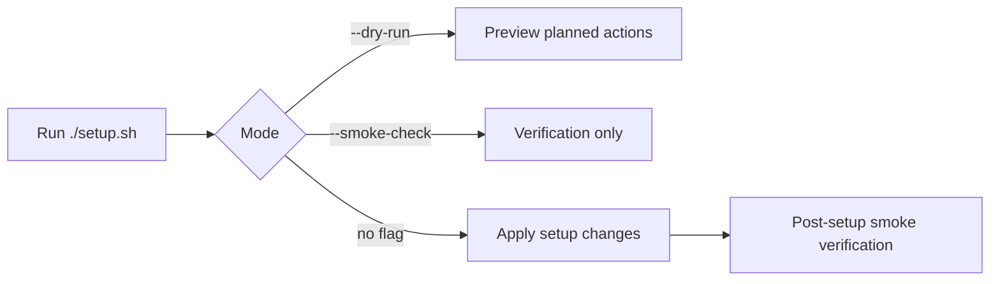

# Dotfiles Bootstrap

Private, personal, internal-only dotfiles SSOT for the `w4w-mbp` rig. Curated desired state for shell, git, Homebrew, nix-darwin, and Chezmoi home config. AI/MCP harness configs live in [wyattowalsh/agents](https://github.com/wyattowalsh/agents).

<!-- BADGES:START -->

[](#prerequisites)
[](./setup.sh)
[](#idempotency-guarantees)
[](./LICENSE)
[](https://github.com/wyattowalsh/dotfiles/commits)

<!-- BADGES:END -->

> [!NOTE]
> The legacy `setup.sh` path remains tuned for Debian/Ubuntu-style systems. The full-rig macOS path is scaffolded around `justfile`, Homebrew Bundle, nix-darwin/Home Manager, Chezmoi-style templates, and internal Fumadocs documentation.

## At a glance

| Platform                              | Entrypoint                                                     | Re-run safety                                                                  |
| ------------------------------------- | -------------------------------------------------------------- | ------------------------------------------------------------------------------ |
| Apple Silicon macOS                   | `just bootstrap --dry-run` then `just bootstrap --apply` | Dry-run-first preview with curated Brew, Nix, Chezmoi, and docs checks |
| Debian/Ubuntu-style Linux (`apt-get`) | [`setup.sh`](./setup.sh)                                       | Safe to re-run with idempotent guards and convergence checks                   |

## Table of contents

- [At a glance](#at-a-glance)
- [Overview](#overview)
- [Quick start](#quick-start)
- [Just workflows](#just-workflows)
- [Run modes](#run-modes)
- [Prerequisites](#prerequisites)
- [What gets installed/configured](#what-gets-installedconfigured)
- [Reference](#reference)
  - [File map](#file-map)
  - [AI harness (external repo)](#ai-harness-external-repo)
  - [Idempotency guarantees](#idempotency-guarantees)
  - [Customization guidance](#customization-guidance)
  - [Troubleshooting](#troubleshooting)
- [Security notes](#security-notes)
- [License](#license)

## Overview

This repository has two entrypoints:

- `justfile` for the full-rig macOS migration and validation workflow.
- [`setup.sh`](./setup.sh) for the existing Debian/Ubuntu bootstrap path.

The macOS target is intentionally layered: Homebrew Bundle for the large app/tool surface, nix-darwin/Home Manager for durable system/user state, Chezmoi-style templates for portable home configuration, and a Fumadocs internal docs site for runbooks and validation.

Key goals:

- ✅ **Repeatable setup** (safe to re-run)
- ✅ **Minimal manual steps**
- ✅ **Clear ownership** of shell/editor/git config (AI harness in [wyattowalsh/agents](https://github.com/wyattowalsh/agents))

> [!TIP]
> Keep this repo in a stable path on disk; symlinks point to the clone location.

---

## SSOT workflow (macOS)

Treat the live Mac as inventory, not something to commit wholesale:

```bash
just inventory-redacted          # refresh local/Brewfile.raw, config-dirs, zsh-inventory
just brew-check && just home-diff
# promote curated changes into brew/, home/, root dotfiles
just check
just bootstrap --apply
```

Operator runbooks: [`docs/content/docs/`](./docs/content/docs/) (build with `just docs-build`).

---

## Quick start

```bash
git clone <your-fork-or-this-repo-url> ~/dev/projects/dotfiles
cd ~/dev/projects/dotfiles
just bootstrap --dry-run
exec zsh -l
```

> [!CAUTION]
> Clone this repo into a permanent path first (for example `~/dotfiles`); moving it later can break symlink targets managed by `setup.sh`.

Checklist:

- [ ] Clone repo to your preferred permanent location
- [ ] Run `just bootstrap --dry-run` on macOS or `./setup.sh --dry-run --verbose` on Linux
- [ ] Review planned changes before applying
- [ ] Open a new terminal (or `exec zsh -l`)
- [ ] Confirm links and tools with the verification steps below

<details>
<summary><strong>Post-install verification</strong></summary>

```bash
ls -l ~/.zshrc ~/.p10k.zsh ~/.gitconfig ~/.ripgreprc ~/.editorconfig
command -v zsh eza lazygit zoxide yazi uv go claude gemini copilot codex
gh extension list | rg gh-copilot
```

</details>

---

## Just workflows

`justfile` is the canonical command surface for the modernized repo:

```bash
just --list
just check
just ci
just smoke
just secrets-scan
just inventory-redacted
just brew-check
just darwin-check
just home-diff
just docs-check
just docs-build
```

`just ci` is the self-contained local equivalent of the GitHub Actions validation path. It runs static checks including zsh syntax validation, smoke checks, installs docs dependencies with `pnpm install --frozen-lockfile`, then typechecks and builds the docs site.

The bootstrap dispatcher defaults to preview behavior unless `--apply` is explicitly supplied:

```bash
just bootstrap --dry-run
just bootstrap --apply
```

The macOS apply path requires `darwin/flake.lock` so nix-darwin checks and fallback commands do not resolve moving upstream refs. Generate that lock with `nix flake lock ./darwin` before applying the bootstrap.

---

## Run modes

`setup.sh` supports hardened execution flags:

- `--dry-run`: print planned actions without mutating system state
- `--verbose`: enable debug logging
- `--smoke-check`: run verification checks only (no setup mutations)

> [!TIP]
> On a new machine, start with `./setup.sh --dry-run --verbose` to preview changes before mutating state.


```mermaid
flowchart LR
  A[Run ./setup.sh] --> B{Mode}
  B -->|--dry-run| C[Preview planned actions]
  B -->|--smoke-check| D[Verification only]
  B -->|no flag| E[Apply setup changes]
  E --> F[Post-setup smoke verification]
```

---

## Prerequisites

| Requirement                 | Why it is needed                                                 | Quick check                      |
| --------------------------- | ---------------------------------------------------------------- | -------------------------------- |
| Linux (`x86_64` or `arm64`) | GitHub-release binaries are architecture-specific                | `uname -m`                       |
| `bash`, `git`, `curl`       | Script runtime + cloning + downloads                             | `command -v bash git curl`       |
| `sudo` (or root)            | `apt-get`, `/usr/local/bin`, `/usr/local/go`, `chsh` flows       | `command -v sudo`                |
| `apt-get`                   | Installs baseline packages and `.deb` release assets[^apt]       | `command -v apt-get`             |
| Internet access             | Fetches installers/assets from GitHub, go.dev, npm, astral, etc. | `curl -I https://api.github.com` |

> [!WARNING]
> On systems without `apt-get`, `setup.sh` skips apt-based installs (including GitHub `.deb` assets like `zoxide` and `yazi`) with warnings.

---

## What gets installed/configured

`setup.sh` performs these high-level phases:

1. Installs missing apt packages (`curl`, `wget`, `unzip`, `zsh`, `fzf`, `bat`, `fd-find`, `ripgrep`, `git-delta`, `direnv`, `jq`)
2. Installs Oh My Zsh + Powerlevel10k + Zsh plugins (autosuggestions/syntax-highlighting)
3. Installs `eza`, `lazygit`, `zoxide`, `yazi` from latest GitHub releases
4. Installs Node via `nvm` (LTS), Python tool runner `uv`, and Go
5. Installs AI CLIs (`claude`, `gemini`, `copilot`, `codex`) plus `gh-copilot` for `gh` (when available), then links startup shims into `~/.local/bin`
6. Installs shared skills from `wyattowalsh/agents` (no `gh:` prefix) for supported CLIs using non-interactive `npx -y skills add --yes` with a dedicated longer timeout
7. Mirrors universal skills from `~/.agents/skills` into `~/.copilot/skills`, `~/.codex/skills`, and `~/.gemini/skills` (when those CLIs are installed) for skill detection
8. Clones `~/dev/tools/agents` and installs optional `wagents` via `uv` (fallbacks to local source install if needed)
9. Symlinks managed config files into `$HOME`
10. Attempts to set default shell to `zsh` (skipped in Codespaces/non-interactive sessions)

<details>
<summary><strong>Detailed install matrix</strong></summary>

| Area                   | Installed/configured by `setup.sh`                                                                                                                              | Idempotent behavior                                                                              |
| ---------------------- | --------------------------------------------------------------------------------------------------------------------------------------------------------------- | ------------------------------------------------------------------------------------------------ |
| Base packages          | apt install of missing tools only                                                                                                                               | Skips commands already present                                                                   |
| Zsh framework          | Oh My Zsh + plugin/theme clones                                                                                                                                 | Clones only when missing                                                                         |
| Node runtime           | `nvm install --lts` + default alias                                                                                                                             | Reuses installed `nvm`; tracks current LTS[^lts]                                                 |
| Python tooling         | `uv` installer                                                                                                                                                  | Skips if `uv` already exists                                                                     |
| Go runtime             | Latest Go tarball into `/usr/local/go`                                                                                                                          | Skips if `go` already exists                                                                     |
| AI CLIs                | npm global `@anthropic-ai/claude-code`, `@google/gemini-cli`, `@github/copilot`, `@openai/codex` + startup shims in `~/.local/bin`                              | Skips each CLI already present and refreshes shim links idempotently                             |
| GitHub Copilot CLI ext | `gh extension install github/gh-copilot` (if `gh` exists)                                                                                                       | Installs only if extension missing                                                               |
| Agent skills           | Non-interactive `npx -y skills add --yes wyattowalsh/agents ... -g` (no `gh:` prefix) for supported agents only, with a dedicated 300s timeout                  | Guard file prevents re-install; auth/network/timeout failures warn and continue                  |
| Skill mirroring        | Symlinks `~/.agents/skills/*` into `~/.copilot/skills`, `~/.codex/skills`, `~/.gemini/skills` (for installed CLIs)                                              | Creates/repairs links idempotently; skips non-symlink user-owned paths                           |
| Agents helper tool     | Clones `~/dev/tools/agents`; optional `wagents` install first uses `uv tool install wagents`, then fallback `uv tool install --from ~/dev/tools/agents wagents` | Warns and continues if `wagents` remains unavailable                                             |
| Dotfile linking        | `ln -sfn` links managed files into `$HOME`                                                                                                                      | Replaces existing symlinks; refuses to overwrite non-symlink paths without manual backup/removal |

</details>

---

## Reference

### File map

| File                                                                   | Role                                                                                            | Destination / usage                      |
| ---------------------------------------------------------------------- | ----------------------------------------------------------------------------------------------- | ---------------------------------------- |
| [`justfile`](./justfile)                                       | Canonical workflow runner for bootstrap, validation, docs, Brew, Darwin, and secrets checks | Run with `just <recipe>`                 |
| [`bootstrap/`](./bootstrap)                                            | macOS full-rig bootstrap dispatcher and subsystem instructions                                  | Run through `just bootstrap`             |
| [`brew/`](./brew)                                                      | Curated Homebrew Bundle desired state and package inventory notes                               | Validate with `just brew-check`          |
| [`darwin/`](./darwin)                                                  | nix-darwin/Home Manager scaffold for Apple Silicon macOS                                        | Validate with `just darwin-check`        |
| [`home/`](./home)                                                      | Chezmoi-style managed home configuration templates                                              | Preview with `just home-diff`            |
| [`.env.example`](./.env.example)                                       | Documented env var names for AI/MCP (values stay local)                                         | Copy exports to `~/.zshrc.local`         |
| [`docs/`](./docs)                                                      | Internal Fumadocs site for runbooks                                                             | Build with `just docs-build`             |
| [`openspec/`](./openspec)                                              | OpenSpec change proposal for the full-rig modernization                                         | Reference for migration scope            |
| [`setup.sh`](./setup.sh)                                               | Bootstrap orchestrator                                                                          | Run manually to converge environment     |
| [`.zshrc`](./.zshrc)                                                   | Shell runtime config, plugins, aliases, lazy `nvm`, fzf/zoxide/direnv hooks                     | Linked to `~/.zshrc`                     |
| [`.p10k.zsh`](./.p10k.zsh)                                             | Lean Powerlevel10k prompt config                                                                | Linked to `~/.p10k.zsh`                  |
| [`home/dot_zshrc.tmpl`](./home/dot_zshrc.tmpl)                         | Chezmoi parity mirror of `.zshrc` (chezmoiignored; bootstrap symlinks root file)                | Kept in sync via `just check-zsh`        |
| [`checks/zsh-inventory.sh`](./checks/zsh-inventory.sh)                 | Redacted local zsh surface inventory for overrides, functions, completions, and custom plugins  | Writes ignored `local/zsh-inventory.txt` |
| [`.gitconfig`](./.gitconfig)                                           | Git defaults + aliases + delta integration                                                      | Linked to `~/.gitconfig`                 |
| [`.ripgreprc`](./.ripgreprc)                                           | Ripgrep defaults (`--hidden`, smart-case, ignores)                                              | Linked to `~/.ripgreprc`                 |
| [`.editorconfig`](./.editorconfig)                                     | Cross-editor formatting defaults                                                                | Linked to `~/.editorconfig`              |
| [`.github/lsp.json`](./.github/lsp.json)                               | Repo-level LSP configuration for GitHub tooling                                                 | Used in-repo                             |
| [`.github/copilot-instructions.md`](./.github/copilot-instructions.md) | Repo instructions for Copilot when editing this repo                                            | Used in-repo                             |
| [`.claude/CLAUDE.md`](./.claude/CLAUDE.md)                             | Claude hint for this repo (delegates to `AGENTS.md`)                                            | Linked to `~/.claude/CLAUDE.md`          |
| [`AGENTS.md`](./AGENTS.md)                                             | Repo conventions, idempotency contract, safety policies                                         | Human/automation reference               |
| [`GEMINI.md`](./GEMINI.md)                                             | Gemini guidance delegating to `AGENTS.md`                                                       | Human/automation reference               |

---

### AI harness (external repo)

MCP servers, client JSON, skills manifests, and agent harness configs are **not** tracked here. SSOT: [wyattowalsh/agents](https://github.com/wyattowalsh/agents).

This repo only documents env var **names** in [`.env.example`](./.env.example). Set values in `~/.zshrc.local` or untracked env files.

On Linux, `setup.sh` still installs AI CLIs and pulls skills from `wyattowalsh/agents` — but MCP/client config comes from the agents repo on your machine, not from dotfiles symlinks.

---

### Idempotency guarantees

This repo explicitly treats idempotency as a contract (see [`AGENTS.md`](./AGENTS.md)):

- installs are guarded with command-exists checks where possible
- preflight checks run before setup to validate required commands/files and privilege availability
- `--smoke-check` runs verification-only mode; `--verbose` additionally runs post-setup smoke checks
- apt metadata refresh is done once per run
- apt update automatically recovers from stale Yarn apt `NO_PUBKEY` failures by removing stale Yarn source entries and retrying once
- a concurrency guard prevents parallel mutating runs (`flock` with mkdir fallback for stale-lock recovery)
- network-sensitive steps use retry+exponential backoff and command timeouts
- privileged apt/system writes are gated through explicit privilege checks and noninteractive apt options
- clones happen only when targets are missing
- symlinks use `ln -sfn` replacement semantics
- structured summary logging reports actions run/skipped plus warning/error counts at exit
- script runs with `set -euo pipefail` to fail fast on required errors, while explicitly optional steps (for example skills/wagents/chsh) warn and continue

> [!NOTE]
> Re-running `./setup.sh` should converge to the same final state without duplicate config artifacts.

---

### Customization guidance

- Use `~/.zshrc.local` for machine-specific overrides (already sourced by `.zshrc`).
- Run `just inventory-redacted` to list local zsh override/function/completion/plugin paths in ignored `local/zsh-inventory.txt`; it never copies file contents or environment values, and it scrubs sensitive-looking path components.
- Tune prompt appearance in [`.p10k.zsh`](./.p10k.zsh).
- Adjust defaults in [`.gitconfig`](./.gitconfig), [`.ripgreprc`](./.ripgreprc), and [`.editorconfig`](./.editorconfig).
- Change MCP/agent harness in [wyattowalsh/agents](https://github.com/wyattowalsh/agents), not in this repo.
- Keep bootstrap logic in [`setup.sh`](./setup.sh) idempotent when adding tools.

---

### Troubleshooting

<details>
<summary><strong>Common issues and fixes</strong></summary>

| Symptom                                               | Likely cause                                                  | Fix                                                                             |
| ----------------------------------------------------- | ------------------------------------------------------------- | ------------------------------------------------------------------------------- |
| `apt-get not found` or `.deb` install errors          | Non-Debian base image / distro                                | Run on Debian/Ubuntu, or adapt `setup.sh` for your package manager              |
| Permission denied writing `/usr/local/*`              | Missing root/sudo rights                                      | Re-run with user that can `sudo`, or run as root                                |
| `gh-copilot` extension not installed                  | `gh` not present                                              | Install GitHub CLI, then re-run `./setup.sh`                                    |
| `copilot`/`codex` auth errors                         | CLI installed but not authenticated for your account/provider | Run each CLI login flow, then retry                                             |
| Skills install warning about auth/network constraints | npm/network outage or missing auth for `wyattowalsh/agents`   | Restore connectivity/auth and re-run `./setup.sh`                               |
| MCP server auth errors                                | Missing API key env vars                                      | Set vars from `.env.example`; manage MCP config in wyattowalsh/agents          |
| New shell not using zsh                               | Codespaces/non-interactive session or `chsh` not permitted    | Run `chsh -s "$(command -v zsh)"` manually in an interactive shell (if allowed) |

</details>

---

## Security notes

> [!WARNING]
> Keep tokens and API keys out of shell history and tracked files; prefer environment variables or untracked local files.

- Do **not** commit secrets (tokens, API keys, private keys) to this repo.
- Keep sensitive values in environment variables or untracked local files.
- `just secrets-scan` scans tracked files only and reports matching filenames without printing secret-shaped values.
- `just inventory-redacted` writes local inventory artifacts under ignored `local/` and intentionally records scrubbed paths only, not file contents or secret values.
- Review any `curl | bash` installer path before running in regulated environments.
- Prefer least privilege; elevate only when setup needs system-level writes.

---

## License

See [LICENSE](./LICENSE).

[^apt]: The script also maps Debian package naming differences (`bat`/`batcat`, `fd`/`fdfind`) in shell behavior.

[^lts]: Node LTS and latest Go version naturally evolve over time as upstream releases change.

[^mcp]: Placeholder syntax keeps secrets out of versioned config while allowing runtime injection.
