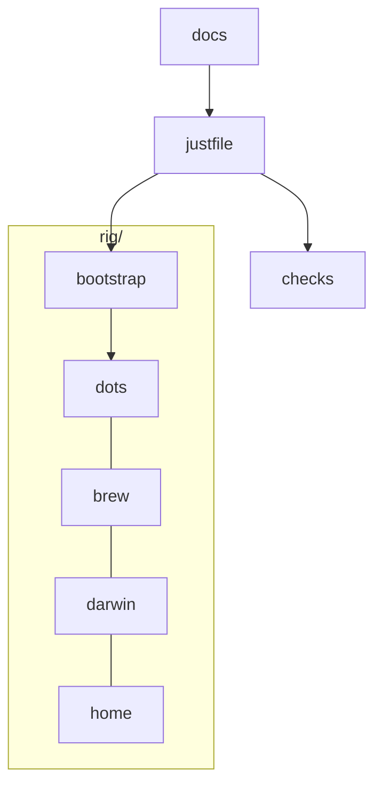

| Domain | SSOT |
| --- | --- |
| Bootstrap | `rig/bootstrap/` → [Fresh Mac](/docs/fresh-mac) · [Linux](/docs/linux-setup) |
| Shell | `rig/dots/zshrc`, `rig/home/dot_zsh/` → [Shell](/docs/shell) |
| Git | `rig/dots/gitconfig` → [Git](/docs/git) |
| Terminal | `rig/home/private_dot_config/ghostty/` → [Terminal](/docs/terminal) |
| Nix | `rig/darwin/` → [Nix](/docs/nix) |
| Brew | `rig/brew/Brewfile` → [Brew](/docs/packages) |
| Home | `rig/home/` → [Home](/docs/home-config) |
| Apple text | `rig/home/private_dot_config/apple-text/` → [Apple text](/docs/apple-text) |
| CLI suite | `rig/brew/Brewfile` + `rig/home/private_dot_config/` → [Brew](/docs/packages) / [Shell](/docs/shell) |
| Backup | `rig/home/dot_local/bin/executable_kopia-nightly` → [Backup](/docs/backup) |
| AI | [wyattowalsh/agents](https://github.com/wyattowalsh/agents) → [AI](/docs/ai-harness) |
| Security | `checks/secrets-scan.sh` → [Security](/docs/security) |
| Docs | `docs/` → [Docs](/docs/docs-maintenance) |

Layout: `rig/*` = machine; `checks` `docs` `openspec` = process. Agent SSOT: root `AGENTS.md`.
