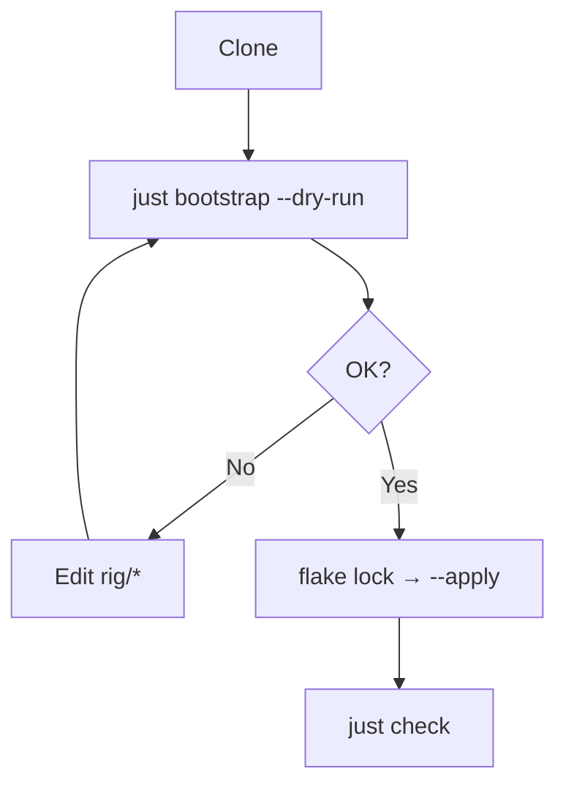

Preview by default. Mutate only with `--apply`.

<Callout type="warn" title="--apply">
  Installs packages (incl. `mas` when listed), rewrites symlinks, may switch nix-darwin. Always `--dry-run` first.
</Callout>

## Run

```bash
git clone <repo> ~/dev/projects/dotfiles && cd ~/dev/projects/dotfiles
just bootstrap --dry-run
nix flake lock ./rig/darwin          # once, before apply
just bootstrap --apply --no-upgrade
just check && just smoke
```



## Needs

- Apple Silicon, network, Xcode CLT
- Apple ID if using `mas`
- Stable clone path (symlinks target it)
- `rig/darwin/flake.lock` before `--apply`

## After

| Check | Command |
| --- | --- |
| Links | `readlink ~/.zshrc` → `…/rig/dots/zshrc` |
| Brew | `just brew-check` |
| Home | `just home-diff` |
| Nix | `just darwin-check` |

Manual: App Store / vendor apps / AI auth. After apply, `just kopia-nightly-install` if the nightly LaunchAgent was skipped. See [Promote](/docs/ssot-workflow), [Brew](/docs/packages), [Backup](/docs/backup), [AI](/docs/ai-harness).
