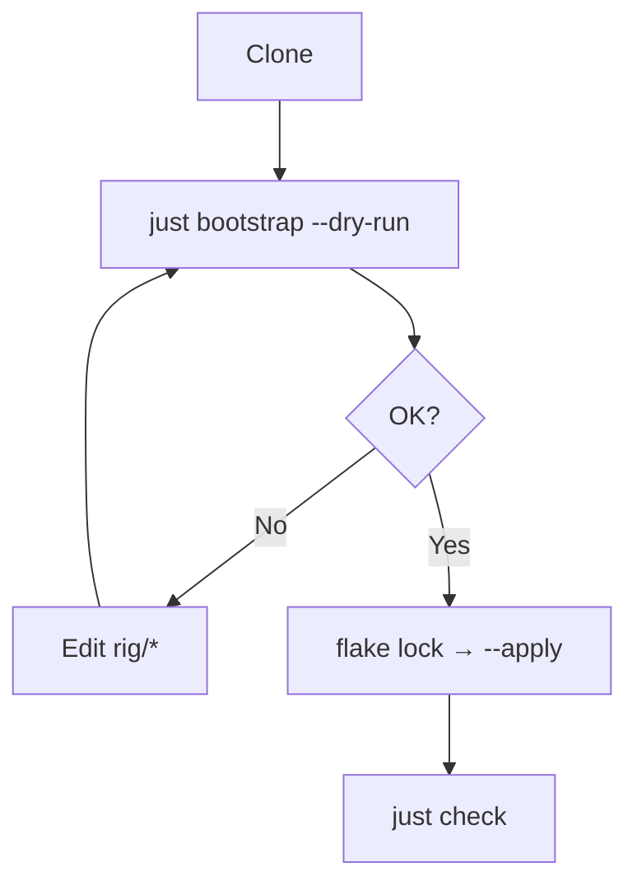

Preview by default. Mutate only with `--apply`. `just bootstrap` on Darwin runs `rig/bootstrap/macos.sh`.

<Callout type="warn" title="--apply">
  Installs packages (incl. `mas` when listed), rewrites symlinks, may switch nix-darwin, and installs the Kopia LaunchAgent when the runner source exists. Always `--dry-run` first.
</Callout>

## Run

```bash
git clone <repo> ~/dev/projects/dotfiles && cd ~/dev/projects/dotfiles
just bootstrap --dry-run
nix flake lock ./rig/darwin          # once, before apply
just bootstrap --apply --no-upgrade
just check && just smoke
```



## Flags

| Flag | Effect |
| --- | --- |
| `--dry-run` | Plan only. Also the default when `--apply` is omitted. |
| `--apply` | Permit mutating setup. Required to install, link, or switch nix-darwin. |
| `--verbose` | Extra diagnostics (`[debug]`). |
| `--no-upgrade` | Pass `--no-upgrade` to `brew bundle install` (safer first restore). |
| `--with-dev-env` | Also run `rig/bootstrap/dev-env.sh` in the same mode. Always adds `--skip-mcphub`. |
| `--require-dev-env` | Implies `--with-dev-env`. Fail if the agent-stack installer fails. |

`--dry-run` and `--apply` cannot be combined (exit 2). `--require-dev-env` without `--with-dev-env` still enables the agent-stack phase.

## Phases

Preflight → sudo keepalive (apply) → Xcode CLT → brew / just / nix / chezmoi → OMZ + p10k → Brewfile → **symlinks from `rig/dots/`** → Chezmoi → **Kopia LaunchAgent** (when `rig/home/dot_local/bin/executable_kopia-nightly` exists) → nix-darwin → optional `dev-env.sh`.

The Kopia phase is part of bootstrap when that source exists — not only `just kopia-nightly-install`. Dry-run previews `install --dry-run`; `--apply` runs `install`. Missing source skips the phase.

nix-darwin: `macos.sh` prefers `darwin-rebuild` on `PATH`. Otherwise it reads `rig/darwin/flake.lock` with `jq` — `locked.owner` / `repo` / `rev`, or a **tarball** lock (`original.owner` / `repo` plus the SHA in `locked.url` `…/archive/<rev>.tar.gz`) — then `nix run github:…#darwin-rebuild`. `--apply` requires the lock file. Gate: `just check-darwin-lock`.

## Needs

- Apple Silicon, network, Xcode CLT
- Apple ID if using `mas`
- Stable clone path (symlinks target it)
- `rig/darwin/flake.lock` before `--apply`

## After

| Check | Command |
| --- | --- |
| Links | `readlink ~/.zshrc` → `…/rig/dots/zshrc` |
| Brew | `just brew-check` |
| Home | `just home-diff` |
| Nix | `just darwin-check` |

Manual: App Store / vendor apps / AI auth. If the LaunchAgent phase was skipped (missing runner source), `just kopia-nightly-install` after apply.

Agent stack (skills, hooks, MCPHub) is a **second** command: `just bootstrap-dev` (no args → `--dry-run`), then `--apply`. Optional `just bootstrap --apply --with-dev-env` runs it in the same mode and always `--skip-mcphub`. See [Promote](/docs/ssot-workflow), [Brew](/docs/packages), [Backup](/docs/backup), [AI](/docs/ai-harness).
