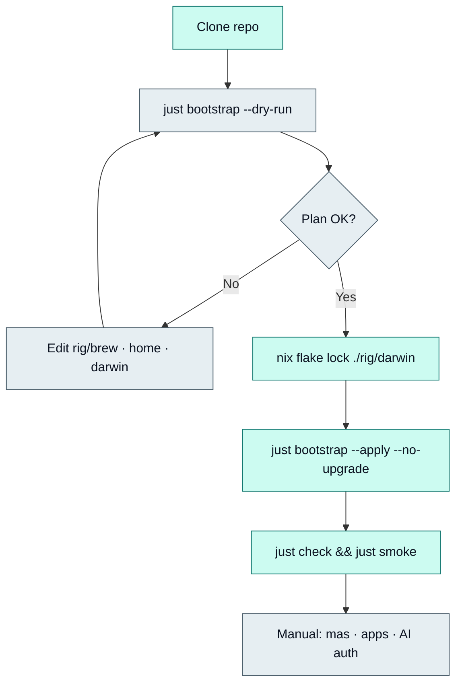

End-to-end bootstrap for a new or reset Mac. Default mode is **preview**; mutating steps require `--apply`.

<Callout type="warn" title="Mutating apply">
  `just bootstrap --apply` installs packages (including App Store apps via `mas` when listed), rewrites symlinks, and may switch nix-darwin. Always run `--dry-run` first and review output.
</Callout>

## Prerequisites

1. **Apple Silicon Mac** — this SSOT targets `aarch64-darwin` / arm64 Homebrew.
2. **Network** and ability to install Xcode Command Line Tools.
3. **Apple ID** signed into the Mac App Store if you want `mas` entries to install.
4. **Stable clone path** — e.g. `~/dev/projects/dotfiles`. Symlinks point at the clone.
5. **`rig/darwin/flake.lock`** — required before `--apply`:

```bash
nix flake lock ./rig/darwin
```

## Bootstrap sequence

```bash
git clone <repo-url> ~/dev/projects/dotfiles
cd ~/dev/projects/dotfiles
just bootstrap --dry-run                 # preview (default without flags)
just bootstrap --apply --no-upgrade      # recommended first restore
exec zsh -l
just check
just smoke
```

### What `rig/bootstrap/macos.sh` does

| Phase | Dry-run | Apply |
| --- | --- | --- |
| Preflight | macOS + non-root checks | Same; refuse root |
| sudo keepalive | — | Background `sudo -v` refresh for long installs |
| Xcode CLT | Plans install | Installs and **waits** until ready (default ~30 min timeout, then fail with re-run hint) |
| Toolchain | Plans brew, just, nix, chezmoi | Installs missing tools |
| Oh My Zsh + Powerlevel10k | Plans ensure | Downloads installer to temp then runs with `KEEP_ZSHRC` (override URL via `OMZ_INSTALL_URL`); creates themes dir before p10k clone; does not fight brew zsh plugins |
| Homebrew Bundle | Runs `brew bundle check` when brew exists (dry-run exits non-zero if check fails after full plan) | `brew bundle install --jobs auto` (+ optional `--no-upgrade`); primary Docker is **Docker Desktop** (`docker-desktop`) |
| `rig/dots` links | Plans `ln -sfn`; non-symlink targets print `would-block` and continue | Creates parents and repairs symlinks; refuses non-symlink clobber |
| Chezmoi | Runs `chezmoi --source rig/home diff` when chezmoi exists | `chezmoi --source rig/home apply` |
| nix-darwin | Runs flake / darwin-rebuild **check** when tools exist | `darwin-rebuild switch --flake ./rig/darwin#w4w-mbp` |

### What bootstrap does **not** do

- Install AI harness / MCP configs (see the agents repo; env var **names** only here)
- Mass-install every VS Code/Cursor extension from local inventory
- Overwrite non-symlink targets at `~/.zshrc` etc.
- Run `brew bundle cleanup`



## Post-bootstrap verification

```bash
ls -l ~/.zshrc ~/.p10k.zsh ~/.gitconfig
readlink ~/.zshrc    # should point into the clone
just brew-check
just home-diff
just darwin-check    # when nix is available
```

## Manual follow-ups

### App Store (`mas`)

Sign in with your Apple ID, then re-run brew bundle or install missing mas apps. Purchases must already be on that account.

### Non-Brew apps (reinstall by name)

These often need a vendor installer or license (not fully expressed as casks). Typical leftovers from a full-rig transfer:

- **FL Studio** (vendor)
- **Beekeeper Studio Ultimate** (licensed build)
- Vendor portals / specialty tools (Hue Sync, Citrix Workspace, iZotope, etc.) as needed
- Safari/web extensions that do not restore cleanly via mas alone

Refresh the basenames list anytime with `just inventory-redacted` → `local/apps-all.txt` (gitignored).

### Secrets and AI

- Authenticate AI CLIs after install
- Put MCP tokens and API keys in **untracked** env files — never in this repo
- Harness/MCP manifests live in the agents repository

### Optional second pass

After the first restore succeeds:

```bash
just bootstrap --apply    # allow brew bundle upgrades
```
