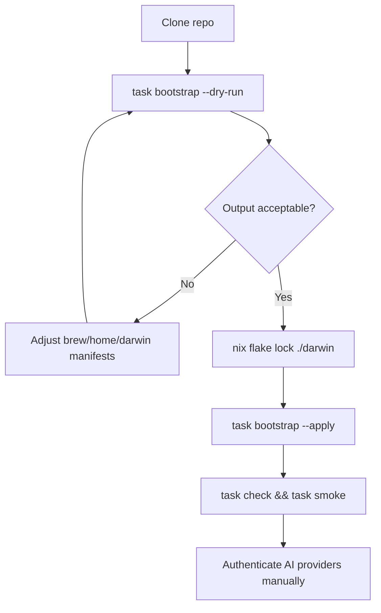

End-to-end bootstrap for a new or reset Mac. Default mode is **preview**; mutating steps require `--apply`.

## Prerequisites

1. **Xcode Command Line Tools** — installed automatically on apply if missing (`xcode-select --install`).
2. **Stable clone path** — e.g. `~/dev/projects/dotfiles`. Symlinks point at the clone; moving it later breaks links.
3. **`darwin/flake.lock`** — required before `--apply`. Generate with:

```bash
nix flake lock ./darwin
```

Commit the lockfile so nix-darwin resolves pinned refs instead of moving upstream heads.

## Bootstrap sequence

```bash
git clone <repo-url> ~/dev/projects/dotfiles
cd ~/dev/projects/dotfiles
task bootstrap -- --dry-run    # preview (default when neither flag is passed)
task bootstrap -- --apply      # mutate after review
exec zsh -l
task check
task smoke
```

### What `bootstrap/macos.sh` does

| Phase | Dry-run | Apply |
| --- | --- | --- |
| Toolchain | Plans brew, task, nix, chezmoi, pnpm installs | Installs missing tools |
| Homebrew | `brew bundle check --file brew/Brewfile` | `brew bundle install` |
| Root dotfiles | Plans `ln -sfn` for `.zshrc`, `.p10k.zsh`, `.gitconfig`, etc. | Creates/repairs symlinks |
| Chezmoi | `chezmoi --source home diff` | `chezmoi --source home apply` |
| nix-darwin | `darwin-rebuild check` or flake check | `darwin-rebuild switch --flake ./darwin#w4w-mbp` |

### What bootstrap does **not** do

- Install or configure AI CLIs, skills, or MCP servers (see `./setup.sh` on Linux or manual macOS install)
- Build or serve the Fumadocs site (use `task docs:build` separately)
- Overwrite non-symlink targets — existing regular files at `~/.zshrc` etc. must be backed up or removed first



## Post-bootstrap verification

```bash
ls -l ~/.zshrc ~/.p10k.zsh ~/.gitconfig
readlink ~/.zshrc    # should point into the clone
task brew:check
task home:diff       # should be clean after apply
task darwin:check    # when nix is available
```

## Manual follow-ups

- Authenticate AI providers (`claude`, `gemini`, `copilot`, `codex`) after CLI install
- Export MCP env vars (`MCPHUB_BEARER_TOKEN`, `BRAVE_API_KEY`, etc.) in shell profile or untracked env files
- Promote additional Homebrew packages from `local/Brewfile.raw` via [SSOT workflow](/docs/ssot-workflow)