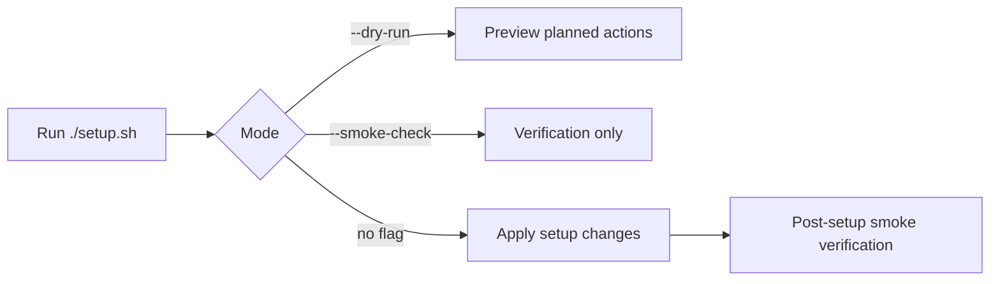

The legacy `setup.sh` path targets Debian/Ubuntu-style systems (`apt-get`). macOS full-rig uses `just bootstrap` instead — see [Fresh Mac](/docs/fresh-mac).

## Quick start

```bash
git clone <repo-url> ~/dev/projects/dotfiles
cd ~/dev/projects/dotfiles
./setup.sh --dry-run --verbose
# review output
./setup.sh
exec zsh -l
```

## Run modes

| Flag | Behavior |
| --- | --- |
| `--dry-run` | Print planned actions without mutating system state |
| `--verbose` | Enable debug logging |
| `--smoke-check` | Verification only (no setup mutations) |



In plain language: dry-run previews, smoke-check verifies, and a plain run applies then smoke-checks.

## Prerequisites

| Requirement | Why | Quick check |
| --- | --- | --- |
| Linux (`x86_64` or `arm64`) | Architecture-specific release binaries | `uname -m` |
| `bash`, `git`, `curl` | Runtime + clone + downloads | `command -v bash git curl` |
| `sudo` (or root) | apt and some system paths | `command -v sudo` |
| `apt-get` | Base packages and some `.deb` assets | `command -v apt-get` |
| Internet | Installers and registries | `curl -I https://api.github.com` |

## High-level phases

1. Install missing apt packages when absent
2. Oh My Zsh + Powerlevel10k + plugins
3. `eza`, `lazygit`, `zoxide`, `yazi` from GitHub releases when missing
4. Node via `nvm` (LTS), `uv`, Go when missing
5. AI CLIs + optional skills from the agents repo (no MCP JSON in this repo)
6. Symlink managed files from `rig/dots/` into `$HOME` (via thin `./setup.sh` → `rig/bootstrap/linux.sh`)
7. Optional default-shell to zsh (skipped in Codespaces / non-interactive)

## Idempotency

Re-running `./setup.sh` should converge without duplicate artifacts. Guards include command-exists checks, concurrency lock, retry/backoff for network steps, and structured exit counters. See root `AGENTS.md` for the full contract.

## AI CLIs on Linux

`setup.sh` may install CLIs and pull skills from [wyattowalsh/agents](https://github.com/wyattowalsh/agents). MCP/client config stays in the agents repo. Env **names** only in [`.env.example`](https://github.com/wyattowalsh/dotfiles/blob/main/.env.example) — never commit values. See [AI harness](/docs/ai-harness).

## Troubleshooting (common)

| Symptom | Likely cause | Fix |
| --- | --- | --- |
| `apt-get not found` | Non-Debian base | Use Debian/Ubuntu or adapt package manager |
| Permission denied under `/usr/local` | Missing sudo | Re-run with privilege or as root |
| AI CLI auth errors | CLI present, not logged in | Complete each CLI’s login flow |
| Skills install warning | Network/auth | Restore connectivity and re-run |
