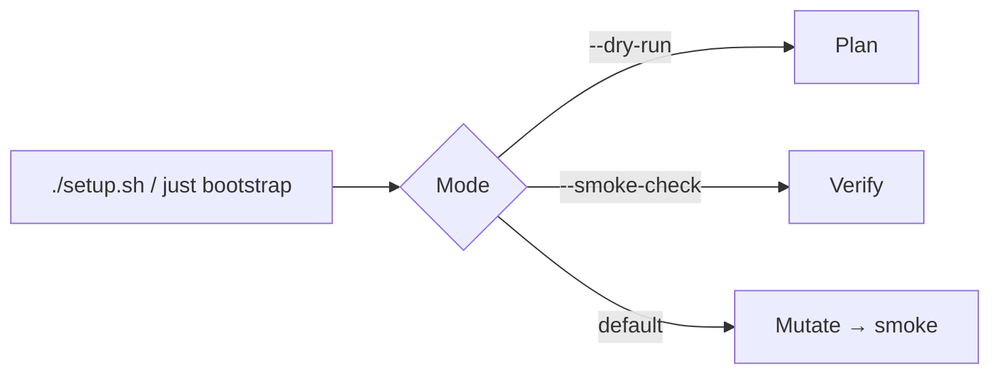

macOS → [Fresh Mac](/docs/fresh-mac). Linux → thin `./setup.sh` → `rig/bootstrap/linux.sh`. `just bootstrap` on Linux now dispatches to the same script.

**Default is mutate.** There is no `--apply` flag. Pass `--dry-run` to plan.

```bash
just bootstrap --dry-run --verbose
./setup.sh --dry-run --verbose
./setup.sh
exec zsh -l
```

| Flag | Effect |
| --- | --- |
| `--dry-run` | Plan only |
| `--verbose` | Debug log |
| `--smoke-check` | Verify only (no setup mutations) |



Do not pass Darwin `--apply` / `--with-dev-env` here — those are unknown options and fail.

Needs: Linux x86_64/arm64, bash/git/curl, sudo, apt, network. Dots from `rig/dots/` are linked **before** Oh My Zsh (`KEEP_ZSHRC=yes` cannot plant a real `~/.zshrc`). OMZ then clones Linux custom plugins (p10k, autosuggestions, syntax-highlighting) under `$ZSH_CUSTOM`. `chsh` is skipped in Codespaces or non-interactive sessions. `setup.sh` also links `~/.zsh/aliases.zsh` from `rig/home/dot_zsh/aliases.zsh`. npm CLIs: `claude`, `copilot`, `codex` (no Gemini CLI) plus `~/.local/bin` shims. App aliases (`opa`, `cda`) need macOS `open`; CLI aliases (`opc`, `cdx`, `grk`, `agt`) work wherever those binaries exist.

After CLI shims, setup delegates the agent stack to `rig/bootstrap/dev-env.sh` (`just bootstrap-dev`) with `--skip-mcphub`. Apply **fail-closes** if the wrapper is missing or the installer exits non-zero. Dry-run warns and continues. `--smoke-check` fails if the wrapper file is missing. It does not run a hardcoded `npx skills add` list. Harness/MCP JSON stays in [agents](https://github.com/wyattowalsh/agents).

Linux bootstrap stays a thin subset. apt installs `shellcheck`, `shfmt`, and `bats` when missing. Optional extras (`lnav`, `mtr-tiny`, `hyperfine`, `jc`, `visidata`, `atuin`, `mq`) are `command -v` guarded in zshrc — install them yourself if needed. **Do not** add Atuin/mq/Agent Deck GitHub-binary sprawl here. **Do not** `apt install yq`: Debian's `yq` is not mikefarah `yq` (Homebrew SSOT). See [AI](/docs/ai-harness) and [Shell](/docs/shell).
