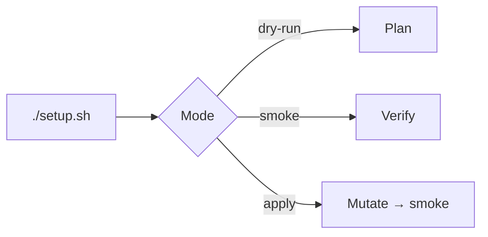

macOS → [Fresh Mac](/docs/fresh-mac). Linux → thin `./setup.sh` → `rig/bootstrap/linux.sh`.

```bash
./setup.sh --dry-run --verbose
./setup.sh
exec zsh -l
```

| Flag | Effect |
| --- | --- |
| `--dry-run` | Plan only |
| `--verbose` | Debug log |
| `--smoke-check` | Verify only |



Needs: Linux x86_64/arm64, bash/git/curl, sudo, apt, network. AI configs → [agents](https://github.com/wyattowalsh/agents).
