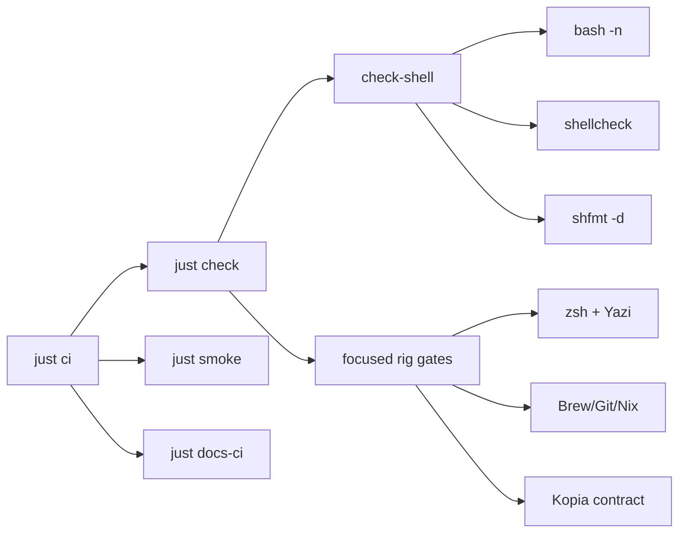

```bash
just check          # aggregate static + focused validation suite
just check-shell    # bash -n + shellcheck + shfmt -d
just check-just-fmt # canonical justfile formatting
just check-mise-boundary
just check-rig-ecosystem-assurance
just check-yazi-config
just check-kopia-nightly
just check-apple-text
just check-iina-config
just iina-qol
just check-bats
just fmt-shell      # shfmt -w (preview: just check-shell)
just smoke          # non-destructive runtime
just ci             # check + smoke + docs-ci
just secrets-scan
just brew-check
just docs-ci
```

| Focused gate | Contract |
| --- | --- |
| `just check-zsh` | zsh syntax/mirror parity, exact plugin/history/load ordering, tracked pnpm completion, `fkill` PID safety, and activation-only `layout_uv` fixtures |
| `just check-rig-ecosystem-assurance` | Agent Deck/tmux ownership, nbdime provider and Git wiring, no unapproved `dft`/difftastic wiring, and no G4 macOS defaults |
| `just check-yazi-config` | Current fields, resolved plugin/flavor locks, dark/light theme mapping, Option DuckDB keys, and isolated native parsing when Yazi is available |
| `just check-kopia-nightly` | Static runner/plist contract (cap in the runner, no launchd `TimeOut`; no live `kopia` / launchd) |
| `just check-apple-text` | Canonical Text Replacement / Shortcuts registries plus offline merge harness (no Apple DB writes) |
| `just check-iina-config` | IINA-QoL input profile, plugin schema, Hammerspoon syntax, chezmoiignore (no live IINA writes) |
| `just iina-qol` | Preview / apply / doctor for the IINA QoL stack (dry-run unless `--apply`) |
| `just check-bats` | File-only Bats coverage when Bats is present; required in CI |



## `just check`

Runs in this order:

| Recipe | What it gates |
| --- | --- |
| `check-hooks` | `pre-commit validate-config` when `pre-commit` is on `PATH` |
| `check-shell` | `bash -n` + `shellcheck` + `shfmt -d` on `shell_files` (required in CI) |
| `check-just-fmt` | `just --unstable --fmt --check` |
| `check-mise-boundary` | no repo-root `mise.toml` / mise `[tasks]` |
| `check-zsh` | `zsh -n`, dots ↔ home `cmp`, `checks/zsh-structure-test.sh`, `zsh-structure.sh`, Atuin init grep, `zsh-home-behavior-test.sh` |
| `check-freshen` | freshen version SSOT + smoke tests |
| `check-json` | `jq empty` on tracked `*.json` |
| `secrets-scan` | obvious secret-shaped values in tracked source |
| `brew-exclude` | Brewfile vs `rig/brew/exclude.txt` (no Homebrew required) |
| `check-rig-ecosystem-assurance` | Agent Deck/tmux ownership, nbdime, no unapproved `dft` wiring |
| `check-yazi-config` | fields, locks, flavors, keys, isolated parse |
| `check-stale-paths` | freeze on pre-`rig/` machine path contracts |
| `check-kopia-nightly` | headless Kopia runner contract (no live `kopia` / launchd) |
| `check-apple-text` | Text Replacement registries + offline merge (no `TextReplacements.db`) |
| `check-iina-config` | IINA-QoL profile, plugin schema, Hammerspoon syntax (no live IINA / Hammerspoon mutation) |
| `check-bats` | `checks/*.bats` when Bats is present; required in CI |
| `check-chezmoi-ignore` | `.chezmoiignore` uses destination/target names |
| `check-darwin-lock` | `flake.lock` JSON + recoverable nix-darwin pin |
| `check-linux-dev-env-rc` | Linux `run_dev_env` exit-status capture (no `$HOME` mutation) |
| `check-shell-files` | justfile `shell_files` matches tracked `*.sh` + Kopia runner |

## Docs / hooks (not inside `just check`)

| Recipe | Role |
| --- | --- |
| `docs-install` | `pnpm install` in `docs/` |
| `docs-check` | typecheck when `docs/node_modules` exists |
| `docs-build` | Fumadocs/Next static build |
| `docs-sensitive` | PII / token-shaped patterns in docs |
| `docs-hub-parity` | `hub-manifest.json` slugs ↔ sidebar `meta.json` |
| `docs-ci` | frozen install + typecheck + build + CSS health + sensitive + hub-parity |
| `hooks-install` | install pre-commit + pre-push hooks |
| `hooks-run` | `pre-commit run --all-files` |
| `hooks-update` | `pre-commit autoupdate` |

`just docs-ci` is what GitHub CI runs for the site (`pnpm install --frozen-lockfile`). Local-only: `just check-zsh-smoke`. Optional when tools exist: `just brew-check`, `just darwin-check`, `just home-diff`.

Full recipe list: `just --list`.
