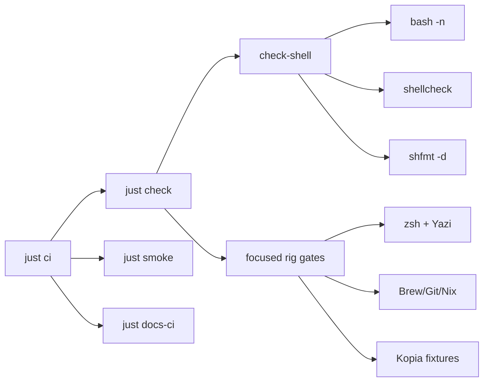

```bash
just check          # aggregate static + focused validation suite
just check-shell    # bash -n + shellcheck + shfmt -d
just check-just-fmt # canonical justfile formatting
just check-mise-boundary
just check-rig-ecosystem-assurance
just check-yazi-config
just check-kopia-nightly
just check-bats
just fmt-shell      # shfmt -w (preview: just check-shell)
just smoke          # non-destructive runtime
just ci             # check + smoke + docs-ci
just secrets-scan
just brew-check
just docs-ci
```

| Focused gate | Contract |
| --- | --- |
| `just check-zsh` | zsh syntax/mirror parity, exact plugin/history/load ordering, tracked pnpm completion, `fkill` PID safety, and activation-only `layout_uv` fixtures |
| `just check-rig-ecosystem-assurance` | Agent Deck/tmux ownership, nbdime provider and Git wiring, no unapproved `dft`/difftastic wiring, and no G4 macOS defaults |
| `just check-yazi-config` | Current fields, resolved plugin/flavor locks, dark/light theme mapping, Option DuckDB keys, and isolated native parsing when Yazi is available |
| `just check-kopia-nightly` | Static runner/plist rules plus offline stub scenarios for timeouts, signals, cleanup, maintenance, and notifications |
| `just check-bats` | File-only Bats coverage when Bats is present; required in CI |



Hooks: `just hooks-install` · `just hooks-run`. Full recipe list: `just --list`.
