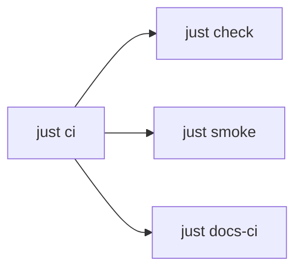

```bash
just check          # static gates below
just smoke          # non-destructive runtime
just ci             # check + smoke + docs-ci
just secrets-scan
just brew-check
just docs-ci
```



## `just check`

Runs in this order:

| Recipe | What it gates |
| --- | --- |
| `check-hooks` | `pre-commit validate-config` when `pre-commit` is on `PATH` |
| `check-shell` | `bash -n` + `shellcheck` on `shell_files` (skip shellcheck if missing) |
| `check-zsh` | `zsh -n`, dots ↔ home `cmp`, `checks/zsh-structure-test.sh`, `zsh-structure.sh` |
| `check-freshen` | freshen version SSOT + smoke tests |
| `check-json` | `jq empty` on tracked `*.json` |
| `secrets-scan` | obvious secret-shaped values in tracked source |
| `brew-exclude` | Brewfile vs `rig/brew/exclude.txt` (no Homebrew required) |
| `check-stale-paths` | freeze on pre-`rig/` machine path contracts |
| `check-kopia-nightly` | headless Kopia runner contract (no live `kopia` / launchd) |
| `check-chezmoi-ignore` | `.chezmoiignore` uses destination/target names |
| `check-darwin-lock` | `flake.lock` JSON + recoverable nix-darwin pin |
| `check-linux-dev-env-rc` | Linux `run_dev_env` exit-status capture (no `$HOME` mutation) |
| `check-shell-files` | justfile `shell_files` matches tracked `*.sh` + Kopia runner |

## Docs / hooks (not inside `just check`)

| Recipe | Role |
| --- | --- |
| `docs-install` | `pnpm install` in `docs/` |
| `docs-check` | typecheck when `docs/node_modules` exists |
| `docs-build` | Fumadocs/Next static build |
| `docs-sensitive` | PII / token-shaped patterns in docs |
| `docs-hub-parity` | `hub-manifest.json` slugs ↔ sidebar `meta.json` |
| `docs-ci` | frozen install + typecheck + build + CSS health + sensitive + hub-parity |
| `hooks-install` | install pre-commit + pre-push hooks |
| `hooks-run` | `pre-commit run --all-files` |
| `hooks-update` | `pre-commit autoupdate` |

`just docs-ci` is what GitHub CI runs for the site (`pnpm install --frozen-lockfile`). Local-only: `just check-zsh-smoke`. Optional when tools exist: `just brew-check`, `just darwin-check`, `just home-diff`.

Full recipe list: `just --list`.
