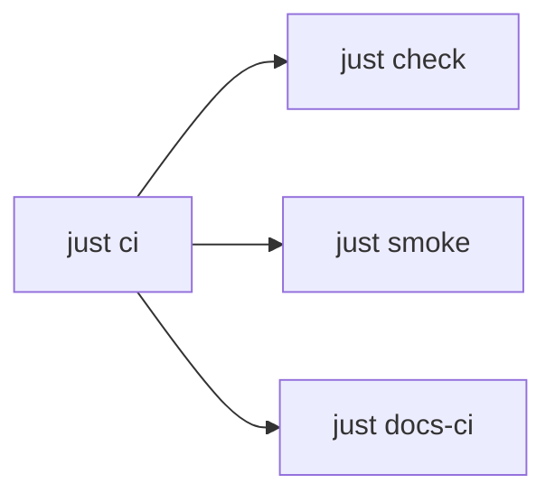

```bash
just check          # hooks shell zsh freshen json secrets + brew-exclude + stale-paths
just smoke          # non-destructive runtime
just ci             # check + smoke + docs-ci
just secrets-scan
just brew-check
just docs-ci
```



Hooks: `just hooks-install` · `just hooks-run`. Full recipe list: `just --list`.
