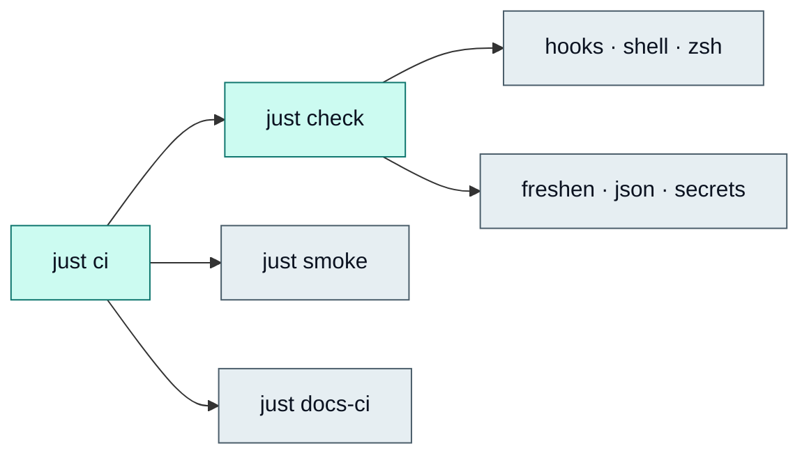

Use `justfile` as the canonical command surface. Checks fail fast on tracked regressions; optional-tool steps skip gracefully when binaries are missing.



## Quick reference

| Task | What it validates |
| --- | --- |
| `just check` | Pre-commit config, shell syntax, zsh parity + structure fixtures, freshen SSOT smoke, JSON schemas, secrets scan |
| `just check-zsh-smoke` | Local interactive zsh smoke (uv/uvx/pnpm/pipx/mise/zoxide); not required in CI |
| `just check-hooks` | `.pre-commit-config.yaml` syntax and hook schema |
| `just check-freshen` | Freshen version SSOT + 311-case zsh smoke harness |
| `just smoke` | Non-destructive runtime smoke checks |
| `just ci` | Full pipeline: `check` + `smoke` + `docs-ci` |
| `just hooks-install` | Install repository `pre-commit` and `pre-push` git hooks |
| `just hooks-run` | Run all configured pre-commit hooks across the repository |
| `just hooks-update` | Update pinned external pre-commit hook revisions |
| `just secrets-scan` | Tracked files for secret-shaped patterns |
| `just brew-check` | `brew bundle check` against curated Brewfile |
| `just darwin-check` | Non-mutating `nix flake check --no-write-lock-file` + `darwin-rebuild check` |
| `just home-diff` | Chezmoi diff preview |
| `just inventory-redacted` | Redacted live-rig inventory under ignored `local/` |
| `just docs-install` | Install docs site dependencies |
| `just docs-check` | Typecheck Fumadocs site |
| `just docs-build` | Production build of docs site |
| `just docs-sensitive` | Docs content sensitive/PII pattern scan |
| `just docs-hub-parity` | Sidebar meta.json ↔ hub-manifest.json slug parity |
| `just docs-ci` | Frozen lockfile install + typecheck + build + CSS health + sensitive + hub-parity |
| `just bootstrap` | macOS full-rig bootstrap (`--dry-run` default) |

## `just check` breakdown

```bash
just check-hooks    # pre-commit validate-config when pre-commit is installed
just check-shell    # bash -n + shellcheck on scripts; shellcheck findings fail when installed
just check-zsh      # zsh -n + dual cmp + checks/zsh-structure{,-test}.sh
just check-zsh-smoke  # local-only interactive tool smoke
just check-freshen  # ./checks/freshen-smoke.sh (version SSOT + 311 tests)
just check-json     # ./checks/validate-json.sh
just secrets-scan   # ./checks/secrets-scan.sh (requires rg)
```

## Git hooks

```bash
just hooks-install
just hooks-run
just hooks-update
```

The tracked `.pre-commit-config.yaml` installs both `pre-commit` and `pre-push` hooks. Commit hooks run structural file checks, targeted shell/zsh/JSON validation, freshen smoke tests when freshen files change, and a tracked-files secrets scan. Push hooks run full `just ci`. Platform convergence checks are available as a manual hook stage:

```bash
pre-commit run --hook-stage manual dotfiles-platform-checks
```

## CI parity

GitHub Actions (`.github/workflows/ci.yml`) runs `just ci` on Ubuntu with `zsh` and `ripgrep` installed. Local pre-push:

```bash
just ci
```

Docs lockfile drift (`docs/pnpm-lock.yaml`) fails `just docs-ci` — run `just docs-install` and commit lock updates when `package.json` changes.

## Pre-apply gate (macOS)

```bash
just check
just bootstrap --dry-run
# review output
just bootstrap --apply
just smoke
```

## Optional skips

When `brew`, `nix`, `chezmoi`, `pre-commit`, or `shellcheck` are not installed, the corresponding recipe prints a skip message and continues. When `pre-commit`, `shellcheck`, `nix`, or `darwin-rebuild` is installed, findings and check failures fail the recipe. CI installs `zsh` and `ripgrep`; macOS dev machines should have brew/nix for meaningful `just brew-check` / `just darwin-check` results.
